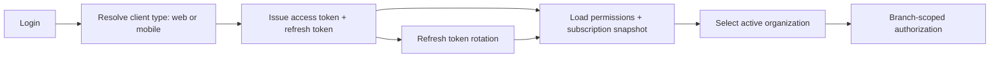
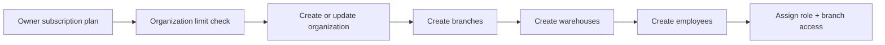
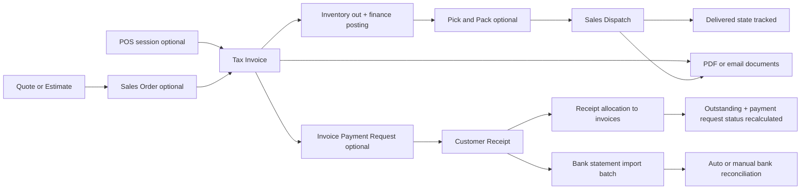
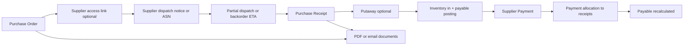
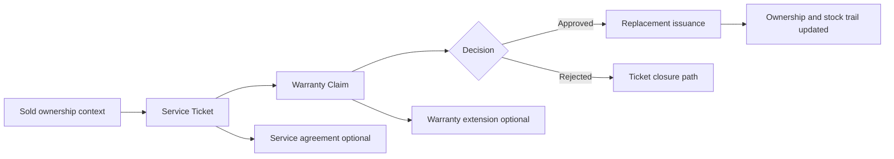

# Retail Management Backend

ERP backend for multi-store retail operations with owner-level subscription governance, org-scoped access, and full commerce lifecycle support (catalog, purchase, sales, inventory, returns, service, finance, reporting, and platform admin).

## Tech Stack

- Java 21
- Spring Boot 3.5.6
- Spring Security (JWT + refresh sessions)
- Spring Data JPA (PostgreSQL)
- Liquibase
- OpenAPI (Swagger)
- iText (PDF), Apache POI (Excel)
- Gradle Wrapper 9.0.0

## Architecture Flow

### 1) Identity, Access, and Organization Context



### 2) Owner Subscription to Organization Setup



### 3) Sales to Cash



### 4) Purchase to Pay



### 5) Service, Warranty, and Agreement Flow



## Module Structure

- `auth`: login/refresh/logout, organization switch, profile, employee membership.
- `erp.foundation`: organizations, branches, warehouses.
- `erp.subscription`: owner subscription and plan propagation to owned organizations.
- `erp.catalog`: shared product catalog, store products, HSN lookup, dynamic attributes, pricing, and bundle or kit definitions.
- `erp.party`: customer and supplier relationship management.
- `erp.imports`: bulk preview and import for customers, suppliers, and products, with import-job history and failed-row export.
- `erp.purchase`: purchase orders, supplier portal dispatch notices, receipts, receipt putaway, supplier payments, allocations.
- `erp.sales`: quotes/orders/invoices, payment requests, plug-and-play gateway abstraction, pick-pack-dispatch fulfillment, customer receipts, allocations.
- `erp.pos`: POS sessions, cashier type-ahead catalog search, exact scan lookup, quick checkout, and walk-in customer flow.
- `erp.inventory`: balances, bin locations, transfers, adjustments, reservations, serial/batch tracking, stock counts, and replenishment planning.
- `erp.returns`: sales and purchase returns with inspection/posting flow.
- `erp.service`: service tickets, warranty claims, replacements, agreements, warranty extensions.
- `erp.finance`: accounts CRUD, vouchers, ledgers, outstanding, summaries, bank import batches, reconciliation.
- `erp.tax`: tax registrations, GST lookup, compliance draft orchestration, compliance submission/sync lifecycle, configurable provider adapters, and GST threshold settings.
- `erp.approval` + `erp.workflow`: approval rules/requests and trigger dispatch.
- `platformadmin`: cross-store admin operations (stores, subscriptions, teams, support, catalog governance, incidents, audit, health).
- `dashboard`, `report`, `notification`: analytics, report scheduling/export, notification channels/templates.

## API Surface (Current Base Paths)

- `/api/auth`, `/api/auth/profile`, `/api/users`
- `/api/erp/organizations`, `/api/erp/branches`, `/api/erp/warehouses`, `/api/erp/employees`
- `/api/erp/subscriptions`
- `/api/erp/catalog`, `/api/erp/catalog/attributes`, `/api/erp/products`, `/api/erp/hsn`
- `/api/erp/customers`, `/api/erp/suppliers`
- `/api/erp/imports`
- `/api/erp/purchases`, `/api/erp/sales`, `/api/erp/sales/recurring-invoices`
- `/api/supplier-portal/purchase-orders`
- `/api/erp/pos`
- `/api/erp/inventory-balances`, `/api/erp/inventory-operations`, `/api/erp/inventory-planning`, `/api/erp/inventory-reservations`, `/api/erp/inventory-tracking`, `/api/erp/inventory-counts`, `/api/erp/stock-movements`
- `/api/erp/returns`, `/api/erp/service`, `/api/erp/finance`, `/api/erp/finance/bank-reconciliation`, `/api/erp/finance/recurring-journals`, `/api/erp/tax`
- `/api/erp/approvals`, `/api/erp/workflow-triggers`, `/api/erp/audit-events`
- `/api/platform-admin`, `/api/dashboard`, `/api/report-schedules`
- `/api/notifications`, `/api/notification-templates`, `/api/notifications/email`, `/api/notifications/sms`

## GST Compliance Lifecycle

Current backend flow:

1. generate draft from posted invoice
2. review warnings and eligibility
3. submit to configured provider abstraction
4. sync latest provider status
5. fetch stored payload and provider response for UI review

Provider note:
- backend can route compliance through pluggable providers
- disabled and simulated providers remain available for non-live environments
- an HTTP provider adapter now exists so a real GST partner can be wired through configuration rather than controller changes

Current endpoints:
- `GET /api/erp/tax/compliance/invoices/{invoiceId}/documents`
- `GET /api/erp/tax/compliance/documents/{documentId}`
- `POST /api/erp/tax/compliance/invoices/{invoiceId}/drafts/e-invoice`
- `POST /api/erp/tax/compliance/invoices/{invoiceId}/drafts/e-way-bill`
- `POST /api/erp/tax/compliance/documents/{documentId}/submit`
- `POST /api/erp/tax/compliance/documents/{documentId}/sync-status`

Current document states:
- `DRAFT`
- `BLOCKED`
- `SUBMITTED`
- `GENERATED`
- `PROVIDER_UNAVAILABLE`

## Payment Gateway Abstraction

Current backend flow:

1. create invoice payment request
2. resolve configured or requested gateway provider
3. generate provider link and store provider metadata
4. sync provider status when needed
5. complete accounting only when receipt is actually posted

Current endpoints:
- `GET /api/erp/sales/payment-gateway/providers`
- `GET /api/erp/sales/payment-requests`
- `GET /api/erp/sales/payment-requests/{id}`
- `GET /api/erp/sales/invoices/{invoiceId}/payment-requests`
- `POST /api/erp/sales/invoices/{invoiceId}/payment-requests`
- `POST /api/erp/sales/payment-requests/{id}/sync-provider-status`
- `POST /api/erp/sales/payment-requests/{id}/cancel`

Current provider implementations:
- `MANUAL`
- `SIMULATED`

## Supplier Purchase Portal

Current backend flow:

1. internal team creates purchase order
2. internal team generates supplier access link for that PO
3. supplier opens public portal link and reviews ordered items plus remaining open quantities
4. supplier submits full or partial dispatch notice with expected delivery and remaining-dispatch ETA
5. internal PO detail shows supplier dispatch summary and notice history
6. internal team still creates the final purchase receipt after physical inward

Current endpoints:
- `POST /api/erp/purchases/orders/{id}/supplier-access-link`
- `GET /api/erp/purchases/orders/{id}/supplier-dispatches`
- `GET /api/supplier-portal/purchase-orders/{accessToken}`
- `POST /api/supplier-portal/purchase-orders/{accessToken}/dispatch-notices`

## Local Run

1. Ensure Java 21 and PostgreSQL are available.
2. Create DB/schema and update local credentials as needed.
3. Set environment variables:
   - `JWT_SECRET`
   - `SMTP_PASSWORD` (if email sending is used)
4. Run:

```bash
./gradlew clean build
./gradlew test
SPRING_PROFILES_ACTIVE=local ./gradlew bootRun
```

### SSL for Upper Environments

Local profile is intentionally HTTP-only (`server.ssl.enabled=false`) to keep development simple.
For upper environments that terminate TLS at the app/container level, enable SSL via environment variables:

```bash
SERVER_SSL_ENABLED=true
SERVER_SSL_KEY_STORE=file:/path/to/keystore.p12
SERVER_SSL_KEY_STORE_PASSWORD=<password>
SERVER_SSL_KEY_STORE_TYPE=PKCS12
SERVER_SSL_KEY_ALIAS=<alias>
# Optional if key password differs from store password
SERVER_SSL_KEY_PASSWORD=<key-password>
```

## Database Bootstrap and Environments

- Active changelog: `src/main/resources/db/changelog/db.changelog-master.yml`
- Bootstrap SQL files:
  - `bootstrap/001_bootstrap_schema.sql`
  - `bootstrap/002_bootstrap_master_data.sql` (`seed` context)
  - `bootstrap/003_bootstrap_demo_data.sql` (`demo` context)
- Local profile uses `seed,demo`; production profile uses `seed` only.
- Legacy incremental migrations are archived under `src/main/resources/db/changelog/legacy`.

## Documentation

- Swagger UI: `http://localhost:8080/swagger-ui/index.html`
- OpenAPI JSON: `http://localhost:8080/v3/api-docs`
- Detailed backend data flow blueprint: `docs/backend_data_flow_blueprint.html`
