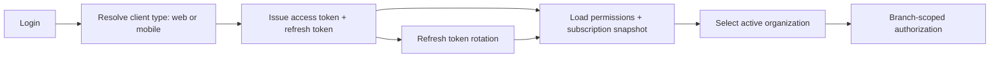
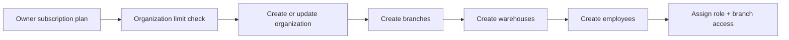
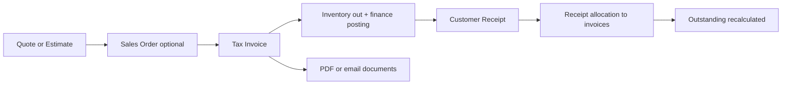
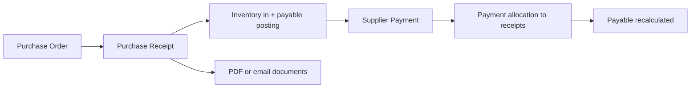
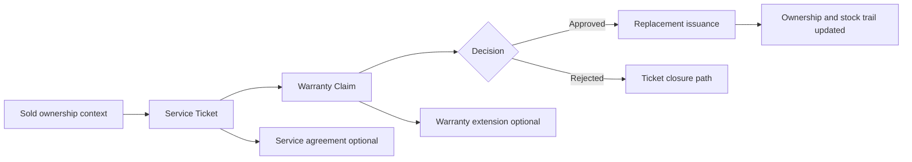

# Retail Management Backend

ERP backend for multi-store retail operations with owner-level subscription governance, org-scoped access, and full commerce lifecycle support (catalog, purchase, sales, inventory, returns, service, finance, reporting, and platform admin).

## Tech Stack

- Java 21
- Spring Boot 3.5.6
- Spring Security (JWT + refresh sessions)
- Spring Data JPA (PostgreSQL)
- Liquibase
- OpenAPI (Swagger)
- iText (PDF), Apache POI (Excel)
- Gradle Wrapper 9.0.0

## Architecture Flow

### 1) Identity, Access, and Organization Context



### 2) Owner Subscription to Organization Setup



### 3) Sales to Cash



### 4) Purchase to Pay



### 5) Service, Warranty, and Agreement Flow



## Module Structure

- `auth`: login/refresh/logout, organization switch, profile, employee membership.
- `erp.foundation`: organizations, branches, warehouses.
- `erp.subscription`: owner subscription and plan propagation to owned organizations.
- `erp.catalog`: shared product catalog, store products, HSN lookup, dynamic attributes, pricing.
- `erp.party`: customer and supplier relationship management.
- `erp.purchase`: purchase orders, receipts, supplier payments, allocations.
- `erp.sales`: quotes/orders/invoices, customer receipts, allocations.
- `erp.inventory`: balances, transfers, adjustments, reservations, serial/batch tracking.
- `erp.returns`: sales and purchase returns with inspection/posting flow.
- `erp.service`: service tickets, warranty claims, replacements, agreements, warranty extensions.
- `erp.finance`: accounts CRUD, vouchers, ledgers, outstanding, summaries, reconciliation.
- `erp.tax`: tax registrations and GST threshold settings.
- `erp.approval` + `erp.workflow`: approval rules/requests and trigger dispatch.
- `platformadmin`: cross-store admin operations (stores, subscriptions, teams, support, audit, health).
- `dashboard`, `report`, `notification`: analytics, report scheduling/export, notification channels/templates.

## API Surface (Current Base Paths)

- `/api/auth`, `/api/auth/profile`, `/api/users`
- `/api/erp/organizations`, `/api/erp/branches`, `/api/erp/warehouses`, `/api/erp/employees`
- `/api/erp/subscriptions`
- `/api/erp/catalog`, `/api/erp/catalog/attributes`, `/api/erp/products`, `/api/erp/hsn`
- `/api/erp/customers`, `/api/erp/suppliers`
- `/api/erp/purchases`, `/api/erp/sales`, `/api/erp/sales/recurring-invoices`
- `/api/erp/inventory-balances`, `/api/erp/inventory-operations`, `/api/erp/inventory-reservations`, `/api/erp/inventory-tracking`, `/api/erp/stock-movements`
- `/api/erp/returns`, `/api/erp/service`, `/api/erp/finance`, `/api/erp/finance/bank-reconciliation`, `/api/erp/finance/recurring-journals`, `/api/erp/tax`
- `/api/erp/approvals`, `/api/erp/workflow-triggers`, `/api/erp/audit-events`
- `/api/platform-admin`, `/api/dashboard`, `/api/report-schedules`
- `/api/notifications`, `/api/notification-templates`, `/api/notifications/email`, `/api/notifications/sms`

## Local Run

1. Ensure Java 21 and PostgreSQL are available.
2. Create DB/schema and update local credentials as needed.
3. Set environment variables:
   - `JWT_SECRET`
   - `SMTP_PASSWORD` (if email sending is used)
4. Run:

```bash
./gradlew clean build
./gradlew test
SPRING_PROFILES_ACTIVE=local ./gradlew bootRun
```

## Database Bootstrap and Environments

- Active changelog: `src/main/resources/db/changelog/db.changelog-master.yml`
- Bootstrap SQL files:
  - `bootstrap/001_bootstrap_schema.sql`
  - `bootstrap/002_bootstrap_master_data.sql` (`seed` context)
  - `bootstrap/003_bootstrap_demo_data.sql` (`demo` context)
- Local profile uses `seed,demo`; production profile uses `seed` only.
- Legacy incremental migrations are archived under `src/main/resources/db/changelog/legacy`.

## Documentation

- Swagger UI: `http://localhost:8080/swagger-ui/index.html`
- OpenAPI JSON: `http://localhost:8080/v3/api-docs`
- Interactive module flow map: `docs/module_flow_map.html`
